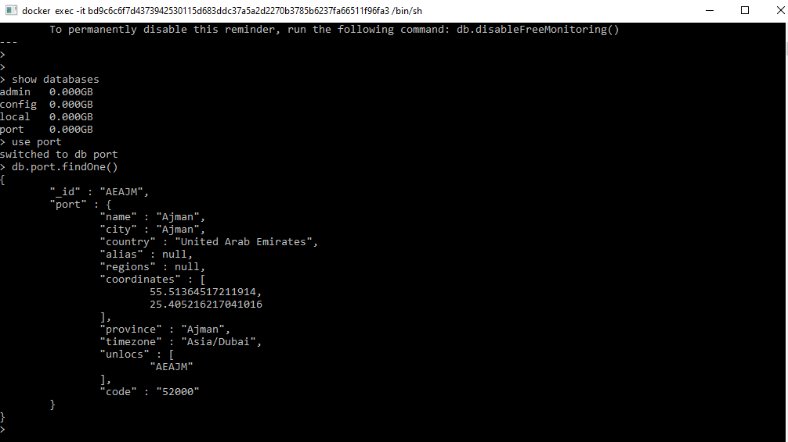

# microservice-exercise
The microservice-exercise enables the update of a database of items.
Those items are given though a file which can be very big in size.

## Basic architecture
The microservice-exercise relies on a MongoDb database instance (so I am using a NoSQL solution for store data in a database). I will call it the mongodb service henceforth.
The service who is responsible to interact with the mongodb service is the port-domain-service, either creates new records in a database, or updates the existing ones.
The input needed for the database update is given through a file.
To present a possible way to upload a file, I am supposing that within the ecosystem in this exercise, there could be a web service with HTTP endpoint from which the upload is possible. 
The web service will be called port-api henceforth.

The microservice-exercise is a dockerized application, it has been developed/tested on:

## Docker Requirements
- docker (20.10.16)
- docker-compose (v1.29.3)

The docker-compose.yaml describes how services (the mongodb service, the port-domain-service, the port-api ) are connected and which are the dependencies among them.

## Additional Requirements
In order to provide a basic e2e test, we rely on curl which I consider the basic way to make HTTP requests (to the port-domain-service).
- curl (7.65.3)

## Protobuf
As far as microservices are concerned, I am supposing that the main communication paradigm should be grpc, so I am assuming that those tools are available
- protobuf 
- protoc-gen-go 
- protoc-gen-go-grpc 
(I had a bit of trouble on windows, things should go smoothier on Linux! Latest version shipped with go 1.17 should be fine!)


## Useful commands on docker and utilities
In order to operate on microservices, I will put in a makefile the common used commands.
It is a very basic documentation!

## Protobuf generation
A Makefile is available on the folder proto, just to make easier the generation of protobuf go files.

## Docker commands
In order to tear up the whole environment, you should firstly type

```
@docker-compose build --no-cache
```
to get the go microservices compiled/built
Secondly, to get all container working you have to type 

```
@docker-compose up --force-recreate
```
Those commands have been added to the makefile, so you can replace the above commands with a simplier 


```
make build
```

```
make up
```

# Go Microservice Package Organization
The data structure of the module relies on a 
- proto folder in which the .proto files of the entities and operations for the entity "port" are described
- cmd folder, that hosts the entry point for the portAPI and the portDomainService

I did not rely on go-micro or go-kit directly, but if I can say something it is a bit inspired by go-kit.
- microservice-exercise/internal/data_model collects the struct definition of entities (port)
- microservice-exercise/internal/database handles the interaction with the database, namely it inserts a port into a database
- microservice-exercise/internal/grpc collects a server and a client for the grpc service
- microservice-exercise/internal/stream is a package dedicated to handle the input of big data files (JSON file for ports)
- microservice-exercise/internal/http_handlers handles a web server for the portAPI service.
- microservice-exercise/internal/transport is a middleware package directly created by compiling proto files

# How to test
To check if everything is working, please follows those instructions

```
make build
```
```
make up
```
```
make upload
```
When connecting to the mongo db instance, you can type the command listed in the picture to see whether the data have been uploaded


## Unit tests
Some basic unit tests are provided for the stream package (intended to read a big-sized json file into a stream).
Those test simply verify that the system is intended to parse a well-known format

Other unit tests has been settled down for the rest api used by portAPI.

Additional test should be added to handle the interaction with the database instance. Unfortunately I had no time to explore about that.

## E2E Test
I did not have time to think about a suite of e2e test, basically I wanted to add an api to retrieve by ID what it has been inserted. 


